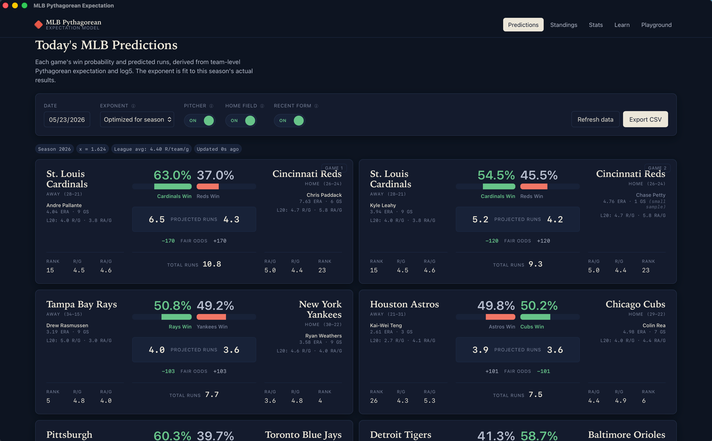
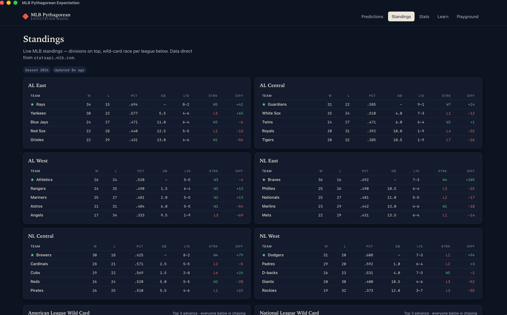
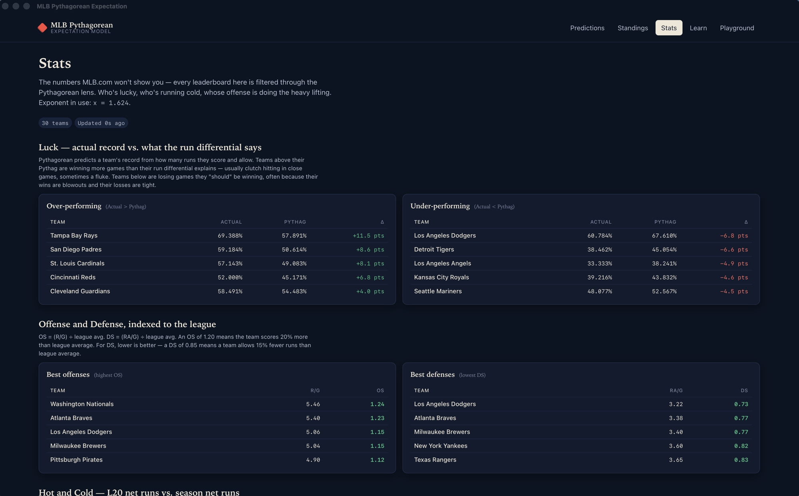
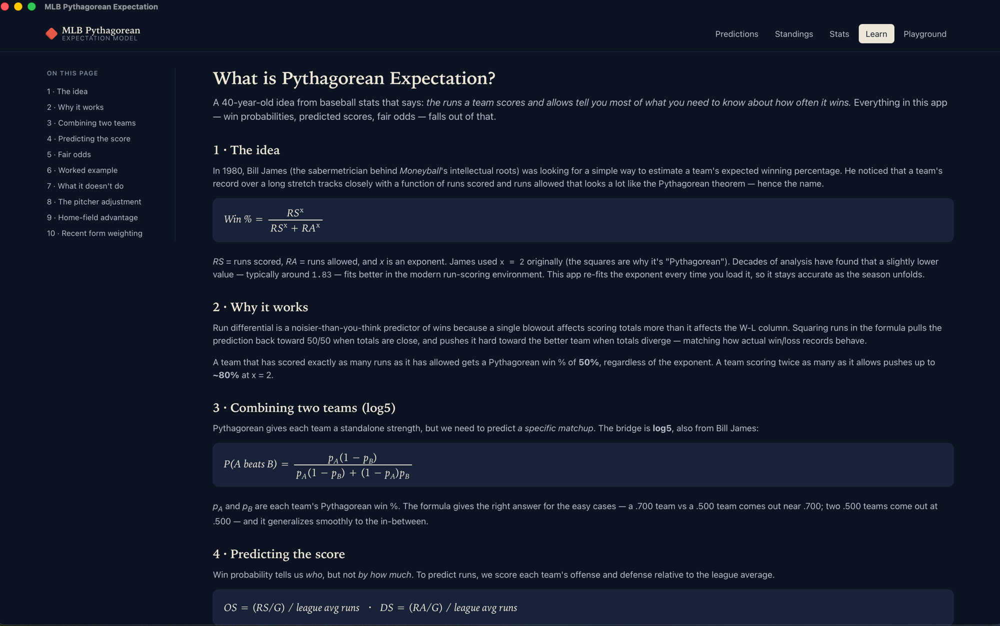
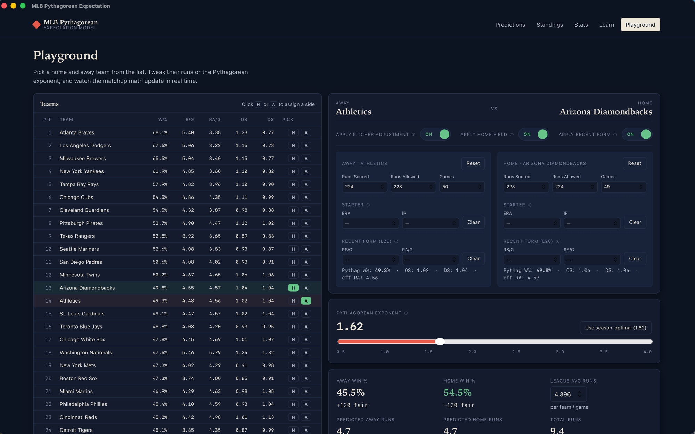

# MLB Pythagorean Expectation

A desktop app — Rust + Tauri — that predicts MLB game outcomes using Bill James' Pythagorean Expectation (augmented with a starting-pitcher adjustment, home-field advantage, and a recent-form L20 blend), shows you the league standings, surfaces model-flavored team stats, and teaches you how the math works.



> Originally written in R. This repo contains both the original R scripts (in [`legacy/`](./legacy)) and the new Tauri rewrite.

## What it does

- **Predictions** — every game on a given date as a self-contained card: away/home team names with their real (W-L) record, win-probability bars (green favored / red underdog), projected runs, fair American odds, season rank, R/G and RA/G per team, the announced starting pitcher with his season ERA, and each team's L20 (last-20-games) scoring line.
- **Standings** — six division tables (AL East / Central / West, NL East / Central / West) plus a wild-card race section per league. Each row shows W · L · PCT · GB · L10 · Streak · Run Diff. Division leaders get a star; teams currently in wild-card position are subtly tinted.
- **Stats** — model-flavored leaderboards you won't find on mlb.com: luck (actual W% vs Pythag W% — who's over- or under-performing their run differential), offense and defense rankings (OS / DS, league-relative), and hot/cold (biggest L20-vs-season net-runs swings). Every section makes an argument the raw box score doesn't.
- **Learn** — an interactive walkthrough of the model: Pythagorean expectation, log5, OS/DS for predicted runs, fair-odds conversion, the pitcher adjustment, home-field advantage, and recent-form weighting. Each section has its own anchor in the left-side TOC.
- **Playground** — a sortable table of all 30 teams (Rank · W% · R/G · RA/G · OS · DS) on the left; pick a Home and Away with one click, then tweak runs, games, the Pythagorean exponent, an optional Starter ERA / IP, and optional L20 RS/G + RA/G overrides on the right. Three toggles let you flip the pitcher adjustment, home-field advantage, and recent-form blend on/off live. The win-prob, predicted runs, fair odds, and a sensitivity chart update instantly.
- Data is pulled directly from the public [MLB Stats API](https://statsapi.mlb.com). Schedule and standings cached for 10 minutes, pitcher stats for 1 hour.

## Screenshots

|  |  |
|:--:|:--:|
|  |  |
| **Standings** — divisions + wild-card race | **Stats** — luck, OS/DS, hot/cold |
|  |  |
| **Learn** — interactive math walkthrough | **Playground** — team-table + matchup editor |

## The model in one paragraph

Each team's standalone strength is its *Pythagorean win %* — `RS^x / (RS^x + RA^x)`, where the exponent `x` is fit to the current season's actual results (typically near 1.6–1.9). Before plugging into Pythagorean we (optionally) blend the team's RS/G and RA/G with its last-20-games rates using a 60% season / 40% recent split, so hot or cold streaks nudge the prediction without overwhelming the larger sample. For any given matchup, if the probable starting pitcher is announced and has at least 20 innings on the season, the team's effective runs-allowed for that game is `0.6 · starter_ERA + 0.4 · (L20-blended) team_RA/G` — capturing the fact that the starter handles ~60% of the innings. The two teams' adjusted Pythagorean win %s are combined into a matchup probability via *log5*. We then apply a home-field shift in log-odds space (equivalent to a +4 percentage-point bump at a 50/50 baseline, matching MLB's historical ~54% home win rate). Predicted runs use offensive and defensive strength (relative to the league average), where defensive strength uses the pitcher-adjusted RA. A full walkthrough is built into the app's Learn tab.

## Toggles

The Predictions and Playground pages each have three toggles you can flip live:

- **Pitcher** — when on, blends the announced starter's ERA into each team's effective RA. When off, prediction is pure team-level Pythagorean.
- **Home Field** — when on, applies the log-odds shift for home-field advantage. When off, the win probability is the neutral-site value (useful for sanity-checking or comparing against neutral-site models).
- **Recent Form** — when on, each team's RS/G and RA/G are 60% season + 40% L20 (last 20 completed games). When off, pure season totals. Below 10 completed games we fall back to season regardless.

Pitcher and L20 info are still displayed when their toggles are off — only the *model use* of those numbers is disabled.

## Running it

Prereqs: a recent Rust toolchain, Node 20+, and pnpm.

```bash
pnpm install
pnpm tauri dev          # launch the dev app
pnpm tauri build        # produce a distributable bundle (.dmg / .app / .msi / .deb)
```

The app fetches the current season's schedule on first load — give it a few seconds. Subsequent loads hit the cache.

## How it's wired

```
src-tauri/src/
├── mlb_api.rs     # statsapi.mlb.com client (schedule + people + standings endpoints)
├── model.rs       # Pythagorean, log5, OS/DS, recent-form blend, pitcher blend,
│                  # home-field shift, golden-section exponent fitter
└── lib.rs         # Tauri commands + in-memory caches

src/
├── routes/
│   ├── +page.svelte                # Predictions (cards)
│   ├── standings/+page.svelte      # Division standings + wild-card race
│   ├── stats/+page.svelte          # Luck / OS+DS / hot+cold leaderboards
│   ├── learn/+page.svelte          # Educational walkthrough w/ left TOC
│   └── playground/+page.svelte     # Team table + matchup editor
└── lib/
    ├── api.ts                      # invoke() wrappers
    ├── types.ts                    # TS types mirroring Rust structs
    └── format.ts                   # %, odds, CSV export
```

## Verifying changes

The fastest way to validate a backend change against live data:

```bash
cd src-tauri
cargo run --example smoke                # today's slate
cargo run --example smoke 2026 2026-05-23 # specific season + date
```

This hits the real MLB API, runs the full prediction pipeline including pitcher fetch, home-field shift, and recent-form aggregation, and prints the resulting prediction table to stdout. Useful for catching regressions in the schedule normalizer, pitcher blend, recent-form, or HFA math before opening the GUI.

```bash
cargo test --lib                        # unit tests (pythag, log5, odds, innings parsing, log-odds shift, recent-form blend)
```

## Roadmap

See [ROADMAP.md](./ROADMAP.md) for the broader feature list. Done so far: **pitcher adjustment**, **standings**, **home-field advantage**, **recent-form weighting**. Up next: live scoreboard, model performance tracker, park factors, and more.

## Acknowledgments

- **Bill James** for the original Pythagorean Expectation and log5 formulations.
- **[MLB Stats API](https://statsapi.mlb.com)** — public, no auth required, replaces what the R `baseballr` package wraps.
- The original R implementation lives in [`legacy/`](./legacy) for reference.

## License

MIT — see [LICENSE](./LICENSE).
